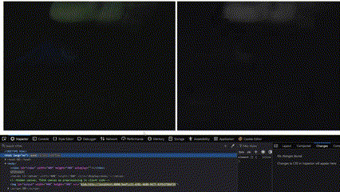

# Minimalistic WebSocket Image Stream Template

This is a minimalistic project template for a real-time image streaming application using a WebSocket server and an HTTP server. The client captures webcam footage, sends it to a WebSocket server for processing (grayscale conversion), and receives the processed image for display.



## Project Structure

```
.
├── client.html          # The client-side HTML file
├── ws_server.py         # WebSocket server (handles image processing)
├── http_server.py       # HTTP server (serves client.html)
├── .env                 # Environment variables configuration
├── start_server.cmd     # Windows script to start both servers
├── start_server.sh      # Linux script to start both servers
├── requirements.txt     # Python dependencies
└── README.md            # Project documentation
```

### Files Overview

- **client.html**: Frontend that captures webcam video, sends frames to the WebSocket server, and displays the processed images.
- **ws_server.py**: WebSocket server that processes the received images (converts them to grayscale) and sends them back to the client.
- **http_server.py**: Simple HTTP server to serve `client.html` to the browser.
- **.env**: Configuration file that contains parameters like client and server width/height and compression quality.
- **requirements.txt**: Lists Python packages required for the project.
- **start_server.cmd** / **start_server.sh**: Scripts to start both the WebSocket and HTTP servers, for Windows and Linux respectively.

## Environment Variables

Environment variables for both the client and the server are configured in the `.env` file.

```
# JPG Compression Quality between 0.0 (lowest) to 1.0 (highest)

# Client-side parameters
CLIENT_WIDTH=40
CLIENT_HEIGHT=30
CLIENT_JPG_COMPRESSION=0.6

# Server-side parameters
SERVER_WIDTH=40
SERVER_HEIGHT=30
SERVER_JPG_COMPRESSION=0.6

# Most browser doesn't allow media access if HTTP or WS is not SECURE for non-localhost, so consider tunneling!
HOST="localhost"
WS_PORT=6969
HTTP_PORT=8080
```

## How It Works

1. **Client Side**:
    - The user’s webcam is accessed via the browser.
    - Frames from the video stream are captured using the `<canvas>` element, compressed, and sent to the WebSocket server.
    - The processed grayscale image is displayed using an `` element.

2. **WebSocket Server** (`ws_server.py`):
    - Receives the video frames as binary data, resizes them, and converts them to grayscale using OpenCV.
    - Sends the processed images back to the client.

3. **HTTP Server** (`http_server.py`):
    - Serves the `client.html` file to the browser.
    - Replaces placeholder values in the HTML file with actual values from the `.env` file (e.g., width, height, compression).

## Requirements

The required dependencies for this project are listed in `requirements.txt`:

**`requirements.txt`**
```
opencv-python-headless
websockets
numpy
python-dotenv
```

Install them by running the following command:

```bash
pip install -r requirements.txt
```

### Why `opencv-python-headless`?

We are using `opencv-python-headless` instead of `opencv-python` because this project doesn’t require any GUI features provided by OpenCV. This reduces the package size and is more suitable for headless environments (like servers).

## How to Run

### Prerequisites

- Python 3
- Install the required dependencies using the command mentioned above.

### Starting the Servers

#### On Windows

Run the `start_server.cmd` file to start both the WebSocket and HTTP servers:

```cmd
start_server.cmd
```

#### On Linux

Run the `start_server.sh` file:

```bash
./start_server.sh
```

### Accessing the Application

Once the servers are running, open your browser and go to:

```
http://localhost:8080/client.html
```

The browser will prompt you to access the webcam. Once granted, the video stream will be sent to the WebSocket server, processed, and displayed as grayscale.

## Project Customization

- **Resolution and Compression**: Both the client and server resolution (width, height) and compression quality can be adjusted via the `.env` file. This allows for easy tuning of performance vs. quality trade-offs.
- **Placeholder Replacement**: The HTTP server replaces `##CLIENT_WIDTH##`, `##CLIENT_HEIGHT##`, and `##CLIENT_JPG_COMPRESSION##` in `client.html` dynamically based on `.env` values.

## Future Improvements

- Add error handling for WebSocket connection loss.
- Implement more complex image processing algorithms.
- Allow dynamic configuration changes without restarting the servers.

## License

This is a simple template and is free to use and modify for any purpose, thanks ChatGPT!